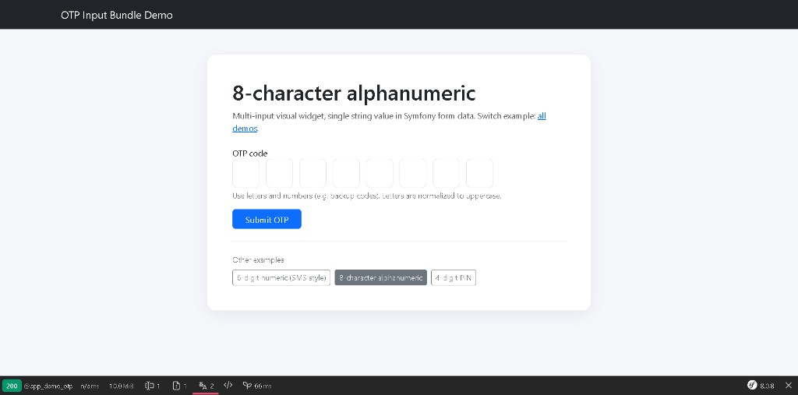

# OTP Input Bundle
[](https://github.com/nowo-tech/OtpInputBundle/actions/workflows/ci.yml)
[](https://packagist.org/packages/nowo-tech/otp-input-bundle)
[](https://packagist.org/packages/nowo-tech/otp-input-bundle)
[](LICENSE)
[](https://php.net)
[](https://symfony.com)
[](https://github.com/nowo-tech/OtpInputBundle)
[](#tests-and-coverage)

> Star **Found this useful?** Install it from Packagist and support the project on GitHub.

Customizable Symfony OTP `FormType` with multiple visible inputs that map to a single field value.

FrankenPHP worker mode: Not declared as supported for this bundle at the moment.

## Demo preview



## Features

- `OtpType::class` for verification codes (2FA, email confirmation, magic code).
- Multi-input UI rendered in Twig form themes.
- Stores data as one string value in your DTO/entity.
- Customizable length, classes, numeric/alphanumeric mode, and uppercase normalization.
- TypeScript + Vite assets in `src/Resources/assets`.

## Documentation

- [Installation](docs/INSTALLATION.md)
- [Configuration](docs/CONFIGURATION.md)
- [Usage](docs/USAGE.md)
- [Contributing](docs/CONTRIBUTING.md)
- [Changelog](docs/CHANGELOG.md)
- [Upgrading](docs/UPGRADING.md)
- [Release](docs/RELEASE.md)
- [Security](docs/SECURITY.md)
- [Engram](docs/ENGRAM.md)

### Additional documentation

- [Demo notes](docs/DEMO-FRANKENPHP.md)

## Quick usage

```php
use Nowo\OtpInputBundle\Form\OtpType;

$builder->add('otpCode', OtpType::class, [
    'length' => 6,
    'numeric_only' => true,
    'container_class' => 'd-flex gap-2',
    'input_class' => 'form-control text-center',
    'gap_class' => 'otp-grid',
]);
```

The value received in `otpCode` is a single string like `123456`.

## Tests and coverage

- PHP: 100%
- TS/JS: 100%
- Python: N/A
